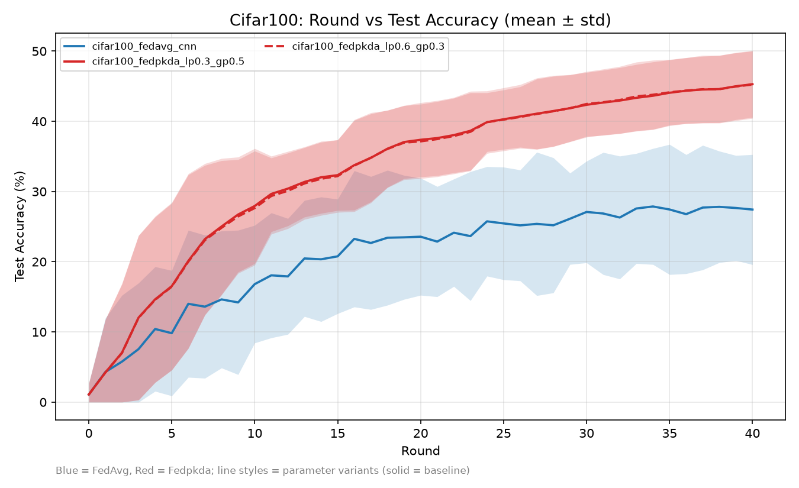
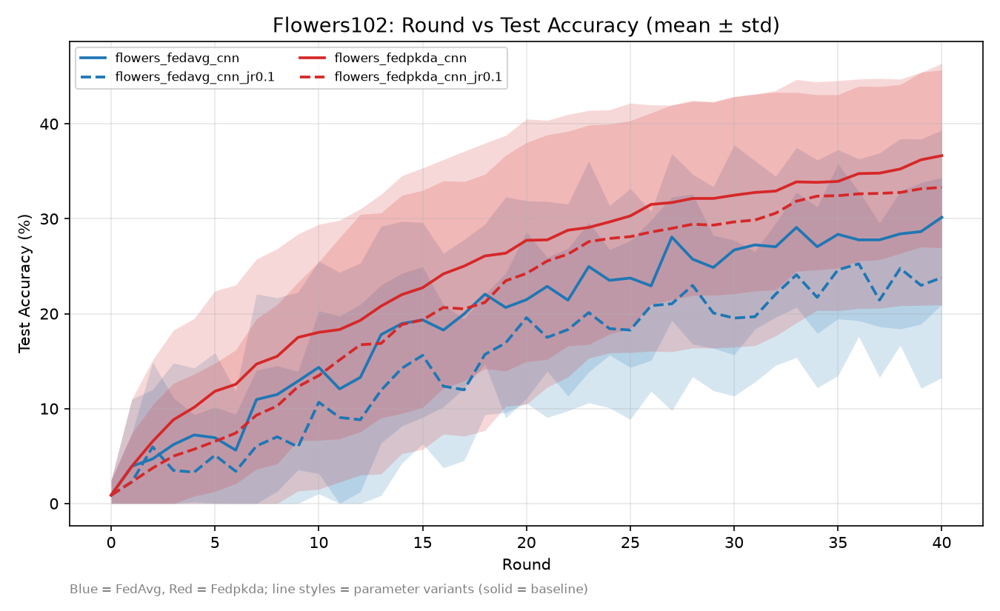
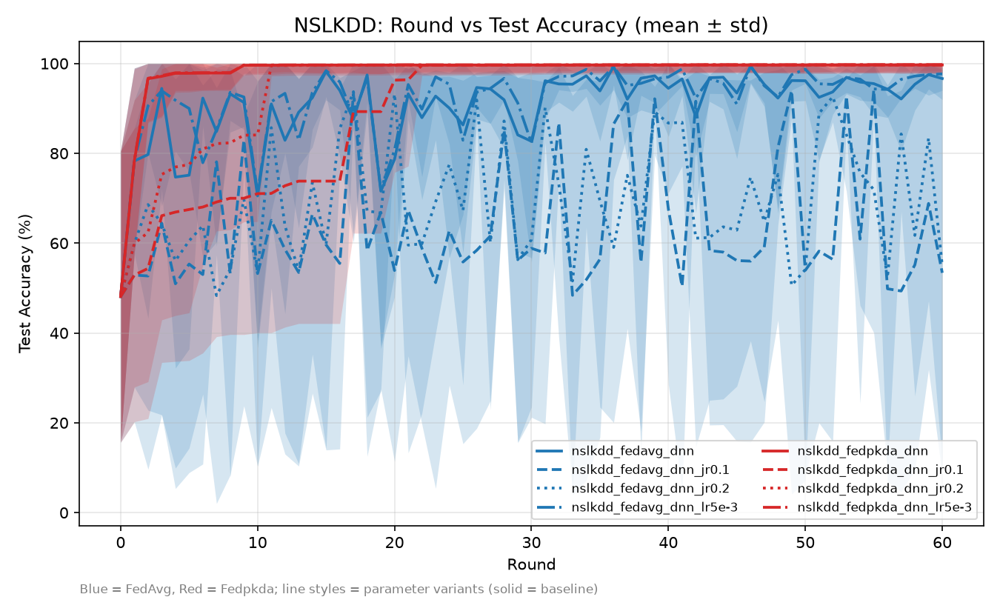
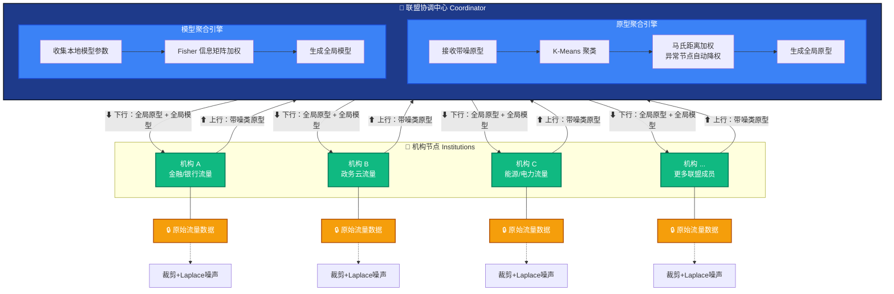

# FedPKDA 联邦入侵检测协作平台 —— 作品说明书

> **作品名称**：（待定）
> **参赛队伍**：（待定）
> **成员**：（待定）
> **日期**：（待定）

---

## 摘要

本作品构建了一个基于 **FedPKDA（AAAI 2026）** 的联邦入侵检测协作平台。平台面向金融、政务、能源、通信等多机构联盟场景，让多家机构在不共享原始数据、不信任彼此的前提下联合训练入侵检测模型，并通过算法机制自动隔离恶意节点。

作品的核心主张是**以技术信任替代法律信任**：传统威胁情报共享依赖法律协议与身份认证，而 FedPKDA 通过"传输带噪类原型而非梯度/原始数据、马氏距离几何滤波自动降权、Fisher 信息矩阵量化贡献、$φ(t)$ 自适应调度"四项机制，从算法层面剥夺了数据被滥用的可能性——即使联盟协调员被攻陷，也拿不到任何可滥用的原始数据。

实验方面，本作品在 3 个数据集（Cifar100 / Flowers102 / NSL-KDD）上完成 15 组实验：异构数据场景下检测率大幅领先 *FedAvg* 基线（最高 +17.42pp）；网络安全场景（*NSL-KDD*）下收敛后零波动，在稀疏参与（节点掉线/少参与）的恶劣条件下保持稳定，而 FedAvg 精度崩塌近 40pp——这一稳定性是论文之外由本作品实测发现的独特优势。

系统方面，作品交付了完整的平台设计：双角色（联盟协调员 / 机构运营员）权限隔离架构、7 页交互原型、21 个后端接口定义与完整通信协议设计。

**主题契合度声明**：本作品属于人工智能技术（联邦学习、隐私保护、自适应调度）在网络安全（入侵检测、威胁情报共享）场景下的系统级应用，符合本次比赛主题要求。

---

## 一、问题背景与分析

### 1.1 联邦学习的隐私悖论

联邦学习（Federated Learning, FL）的核心思想是"数据不出域、模型参数流动"——各参与方在本地数据上训练，仅上传模型梯度或参数，由服务器聚合。然而这一机制存在三个结构性缺陷：

1. **梯度传输可逆**：研究表明（Zhu et al., 2019, DLG 攻击），攻击者可从梯度中像素级重建原始训练数据。共享行为反而扩大了数据暴露面——原本不出域的数据，通过梯度间接泄露。
2. **全局模型压平个性化需求**：FedAvg 让所有客户端共享同一全局模型，在数据高度异构的联盟中（如银行流量 vs 电力流量），本地表现严重退化。
3. **无法抵抗叛变节点投毒**：恶意客户端上传虚假参数即可污染全局模型，联盟规模越大，风险越高。

### 1.2 ISAC 共享机制的结构性缺陷

ISAC（Information Sharing and Analysis Center）是美国最成熟的行业威胁情报共享机制，但存在根本性局限：

- **信任基于"你是谁"**：成员通过法律协议互相信任，协调员作为信息集散中心拥有最高数据访问权限；
- **协调员是最大安全风险点**：他能看到所有共享数据，一旦被攻陷或被收买，整个联盟的数据全部暴露；
- **共享依赖人工判断**：分析员逐条决定"能不能发"，慢且不一致；
- **搭便车无法度量**：没有技术手段检测"只下载模型、不贡献数据"的行为。

### 1.3 行业需求量化

- IBM《数据泄露成本报告》：全球平均单次数据泄露成本达 **445 万–488 万美元**，创历史新高；金融、医疗等关键行业损失远超平均值。
- 攻击发现与遏制平均生命周期长达 **277 天**（识别 204 天 + 遏制 73 天）。
- 深度应用自动化与 AI 协同技术的机构，单次泄露成本平均**节省约 176 万美元**。
- 传统静态 IOC（IP/Hash）时效极短（通常不足 24–48 小时）；机构受合规红线与商业机密限制不敢共享原始日志，形成严重**数据孤岛**。

### 1.4 目标场景

本作品面向**网络安全联盟**：多家机构（省级银行、政务云、电力集团、通信运营商、交通等）联合训练入侵检测模型。场景特征：数据高度异构、隐私要求高（不共享原始流量数据）、联盟内存在被攻陷节点投毒的风险。

---

## 二、相关工作与竞品对比

### 2.1 传统威胁情报共享（ISAC / MISP）

采用 STIX/TAXII 标准化协议与 TLP 受控共享分级（RED/AMBER/GREEN/CLEAR），但存在明显局限：

- 共享明文/脱敏后的静态 IOC（IP/Hash/域名），**依赖人工脱敏，易遗漏敏感信息**；
- 时效性差，静态规则难以抵御未知/新型威胁；
- 因商业机密顾虑，参与机构共享意愿低。

### 2.2 联邦学习平台（FATE / Flower 等）

- 集中/分布式传输模型梯度或参数，**面临梯度逆向还原攻击**（DLG）；
- 要求各节点神经网络结构高度一致，异构系统对接成本高；
- 通信频次高、带宽与算力开销大。

### 2.3 商用 SOC / 威胁情报产品（CrowdStrike / 奇安信等）

- 集中上报日志/遥测数据至云端或本地 SOC，**数据完全托管给单一厂商**，存在供应商锁定风险；
- 依赖单一厂商的分析库，跨厂商/跨机构协同困难；
- 授权与建设成本昂贵。

### 2.4 本方案定位与对比

| 对比维度    | 传统 ISAC / MISP | 联邦学习平台 (FATE, Flower) | 商用 SOC / 威胁情报产品  | **本作品（FedPKDA 平台）**     |
|:------- |:-------------- |:--------------------- |:---------------- |:----------------------- |
| 数据共享机制  | 共享明文/脱敏后静态 IOC | 传输模型梯度或参数             | 集中上报日志/遥测至云端     | **带噪类原型（原始数据不出域）**      |
| 隐私与合规   | 人工脱敏，存在合规风险    | 梯度可被逆向还原              | 集中存储，面临《数安法》出境限制 | **严格满足《数安法》《网安法》**      |
| 情报时效与智能 | 静态规则，时效差       | 批量离线训练，实时性低           | 实时性好，依赖单一厂商      | **实时动态知识转移，高适应能力**      |
| 异构兼容性   | 依赖统一格式，对接成本高   | 要求网络结构高度一致            | 绑定厂商生态           | **支持异构模型与节点协作**         |
| 通信与算力开销 | 通信低但缺模型化情报     | 通信频次高、开销大             | 建设成本昂贵           | **轻量化通信开销**             |
| 机构协作意愿  | 顾虑商业机密，意愿低     | 算法复杂、存在泄露隐患           | 供应商锁定风险          | **"数据不出域、知识可共享"，天然高信任** |

---

## 三、创新点总览

### 3.1 核心主张：技术信任替代法律信任

传统 ISAC 共享机制依赖法律协议和控制制度保护数据安全——**信任基于"你是谁"**。本作品通过算法本身剥夺数据被滥用的可能性——**信任基于"你技术上做不了坏事"**：

| 维度      | ISAC 模式     | FedPKDA 模式              |
| ------- | ----------- | ----------------------- |
| 传输内容    | 原始/脱敏事件数据   | 裁剪+噪声原型（PSNR 6.9，数学不可逆） |
| 协调员能看什么 | 所有共享数据      | 仅聚合统计指标                 |
| 信任基础    | 法律协议 + 身份认证 | 算法保证"做不了坏事"             |
| 异常检测    | 人工举报/主动披露   | 马氏距离自动计算                |
| 贡献度量    | 无法精确量化      | Fisher 信息矩阵天然量化         |
| 共享决策    | 分析员人工判断     | 算法自动加噪上传                |

### 3.2 四大技术手段

1. **传输原型而非梯度**：裁剪 + 拉普拉斯噪声，PSNR 6.9 dB，数学上不可逆；
2. **马氏距离自动隔离**：异常节点无需人工举报，自动降权（隔离是机制的自然结果）；
3. **Fisher 量化贡献**：搭便车在数学上无意义，自动降权；
4. **φ(t) 自适应调度**：早期个性化、后期全局泛化，零人工调参。

### 3.3 结果：协调员角色退化

协调员从"必须绝对可信的信息集散中心"退化为**轻量的系统管理员**——能看告警和统计，但技术上拿不到任何可滥用的数据。这不是权限控制的改良，而是**架构本身就剥夺了滥用数据的可能性**。

---

## 四、算法设计

> 本节对应论文 *Personalized Federated Learning with Privacy-Preserving Knowledge Dynamic Alignment*（AAAI 2026）。数学原理与推导详见附录引用。

### 4.1 总体框架

每轮训练是一个八步循环，数据流向为 客户端 → 服务器 → 客户端：

```
① 本地训练：各机构在本地网络流量数据上训练特征提取器（数据不出域）
② 原型提取：计算每个攻击类别的特征中心（类原型）
③ 加噪上传：裁剪到 [-1,1] + 拉普拉斯噪声 → 上传带噪原型
④ 服务端聚合：K-Means 聚类 → 马氏距离计算 → 距离加权平均 → 全局原型
   （异常节点自动降权，马氏距离 > 3σ 触发告警事件）
⑤ 全局原型广播：全局原型发回各机构
⑥ 双对齐训练：本地对齐 (L_LA) + 全局对齐 (L_GA)，φ(t) 自动调节权重
⑦ Fisher 加权聚合：各节点贡献度量化，搭便车自动降权
⑧ 进入下一轮
```

### 4.2 模块一：跨客户端原型隐私保护

- **特征裁剪（Clipping）**：将特征向量裁剪至固定范围 `[-1,1]` ，降低敏感信息泄漏风险；

- **类原型（Class Prototype）**：同一类别所有样本在特征空间中的均值向量。原型是类别语义的压缩抽象——"平均脸"无法还原任何一张具体的人脸，信息被高度压缩和泛化；

- **拉普拉斯噪声注入**：对原型施加 Laplace 噪声 $ξ \sim Lap(0, b)$，提供可量化的 **ε-DP** 数学保障——即使原型被截获也无法还原；
  
  > 平台隐私预算采用差分隐私审计口径：总预算 $\varepsilon=5.8$，当前配置已消耗 $\varepsilon=2.4$（前端实时展示）；运营员可通过调节噪声注入强度权衡隐私与精度，ε 消耗随之变化并可视化追踪。论文攻击实验表明该机制下 PSNR 约 6.9 dB（重建结果近似随机噪声）。

- 上传内容为带噪原型 $p = p_0 + ξ$，**非梯度、非样本**。

### 4.3 模块二：服务器端几何滤波

- **K-Means 聚类**：对收集到的所有带噪原型求几何中心 $μ_k$；

- **马氏距离**：计算每个原型与中心的马氏距离（考虑协方差分布），度量"偏离了多少个标准差"；

- **反距离加权聚合**：聚合权重与距离成反比 $w_i^k ∝ \frac{1}{d_i^k}$ → 偏离越远权重越低；

- **效果**：高度偏离的噪声/投毒原型获得近零权重，服务器在**不接触未扰动数据**的情况下重建干净、稳健的全局原型。恶意节点隔离是机制的自然结果，无需人工判决。
  
  > **注（投毒防御的理论边界）**：在多元正态假设下，马氏距离平方服从卡方分布——原型距离超过高置信分位（如 $\sqrt{\chi^2_{0.99}(p)}$，$p$ 为特征维度）时视为统计离群，其反距离权重显著低于正常原型，投毒影响被几何滤波机制抑制。全局协方差矩阵由服务端动态计算且不对客户端公开，攻击者难以精确预知聚合决策边界。对抗性投毒验证实验已列入下一阶段计划。

### 4.4 模块三：客户端知识动态对齐

- **双对齐损失**：本地对齐损失 $L_{LA}$（与本地原型对齐，保留个性化）+ 全局对齐损失 $L_{GA}$（与全局原型对齐，吸收共识）：
  
  $L_{align} = ω_{local} \cdot (1 - φ(t)) \cdot L_{LA} + ω_{global} \cdot φ(t) \cdot L_{GA}$

- **时间激活函数 φ(t)**：严格单调递增。训练早期 $φ(t)$ → 0（偏重本地，先稳定自身特征空间），后期 $φ(t)$ → 1（偏重全局，吸收跨客户端共识）；

- **效果**：早期快速学习本地威胁特征，后期吸收联盟预警信号，**零人工调参**——缓解"过度个性化导致未见样本表现下降"的表示偏差问题。

### 4.5 模型聚合：Fisher 信息矩阵加权

通过本地损失函数对模型参数的二阶导数近似 Fisher 信息矩阵，衡量每个参数的重要性，加权聚合时保护**高密度/稀有**的本地知识不被平均掉，同时量化每个节点的贡献权重——贡献低的节点（搭便车者）自动降权。

### 4.6 设计思路说明

本节说明算法设计中的关键权衡与决策依据，体现"为什么这样设计"的分析过程。

**为什么传原型不传梯度**

梯度包含个体级信息、可被 DLG 逆向；原型是类别级语义摘要，加噪后数学不可逆——从传输环节根除数据还原路径，而不是依赖事后防护；

**为什么用马氏距离而非欧氏距离**

欧氏距离只看"远近"、忽略分布形状；马氏距离考虑协方差，能精准定位概率密度最高区域，对分布形变鲁棒——在异构数据联盟中，各机构原型分布形状差异大，欧氏距离会被分布形态误导；

**为什么 φ(t) 动态调度而非固定权重**

固定权重需人工调参且无法适应训练阶段变化；φ(t) 随训练进程自动演化，将"何时个性化、何时泛化"的决策交由机制完成——零人工调参，也避免"调参玄学"带来的不可复现；

**为什么用拉普拉斯噪声而非高斯噪声**

拉普拉斯机制基于 L1 敏感度（与裁剪的定义自然匹配），提供严格的 ε-差分隐私（而非高斯机制的近似 (ε,δ)-DP）——隐私保障可量化、可审计，平台中 ε 预算全程可视化可追踪，这是面向合规场景的关键选择；

**为什么 Fisher 加权聚合**

简单平均会稀释高密度/稀有的本地知识；Fisher 信息矩阵刻画参数重要性，加权聚合保护关键本地知识不被平均掉——同时贡献权重被天然量化，搭便车自动降权，一个机制同时解决"知识保护"与"贡献度量"两个问题；

**为什么裁剪到固定范围**

裁剪限制函数敏感度$\Delta f$，使噪声尺度 $b=\frac{\Delta f}{ε}$ 可控可规划（隐私预算与噪声强度的对应关系清晰），并统一原型数值范围便于服务器端聚合。

---

## 五、实验验证

### 5.1 实验设置

- **环境**：Fedora Linux 44 (Server Edition) x86_64，Intel i7-14650HX，NVIDIA RTX 5060 Max-Q；Python 3.12 + PyTorch；
- **数据**：Cifar100（图像异构基准）、Flowers102（细粒度图像异构）、NSL-KDD（网络安全入侵检测，按客户端分片为 20 个客户端，模拟真实联盟中不同机构遭受攻击类型分布差异显著的异构场景）。
- **方法**：FedPKDA vs FedAvg 基线，含参数变体（参与率 jr、学习率 lr、对齐权重 lp/gp）；
- **规模**：15 组实验，每组单次运行（run=0），41–61 轮；误差带为各客户端测试精度分布标准差；
- **复现**（精简步骤）：
  1. `conda create -n robocup python=3.12`，安装 PyTorch、h5py 等依赖；
  2. 数据由仓库脚本按客户端分片生成（Cifar100 / NSL-KDD 各 20 客户端，Flowers102 35 客户端）；
  3. `python main.py` 批量训练 15 组实验，每轮测试精度自动保存至 `results/*.h5`；
  4. 汇总表与曲线图由python脚本根据实验结果汇总生成。
  - 完整脚本与复现说明：算法仓库 <https://github.com/IridiumNan/FedPKDA>

### 5.2 异构数据场景：检测率大幅领先

| 数据集        | 算法                | 最佳精度       | 差距           |
| ---------- | ----------------- | ---------- | ------------ |
| Cifar100   | FedAvg (CNN)      | 27.87%     | —            |
| Cifar100   | **FedPKDA (CNN)** | **45.29%** | **+17.42pp** |
| Flowers102 | FedAvg (CNN)      | 30.15%     | —            |
| Flowers102 | **FedPKDA (CNN)** | **36.65%** | **+6.50pp**  |





论文在 12 个 **SOTA 基线对比中同样领先**（CIFAR-100 β=0.3 下 44.91%，超亚军 FedAS 4.23pp）——本作品实测结果与论文结论相互印证。

下面是论文原文中的实验结果


### 5.3 网络安全场景：稳定性（核心优势）

> 该*稳定性*是**论文未提及、由本作品实测发现**的独特优势，是本作品在安全场景落地的最大论据。

| 配置          | FedAvg best→final               | FedPKDA best→final     | 收敛后波动 (last 10 轮 std) |
| ----------- | ------------------------------- | ---------------------- | --------------------- |
| 基准          | 99.35% → 96.64%（-2.7pp）         | 99.68% → 99.68%（±0）    | 1.76 vs **0.00**      |
| 稀疏参与 jr=0.1 | 94.09% → 53.39%（**崩塌 -40.7pp**） | 99.67% → 99.66%（±0.01） | 15.68 vs **0.00**     |
| 稀疏参与 jr=0.2 | 93.72% → 55.02%（**崩塌 -38.7pp**） | 99.68% → 99.67%（±0.02） | 13.57 vs **0.00**     |



**关键观察**：

- 收敛后 FedPKDA 在 NSL-KDD 上最后 10 轮波动 std = 0.00（极其稳定），FedAvg 波动 1.2~15.7；
- **稀疏参与（节点掉线/少参与是安全联盟常态）下，FedAvg 精度崩塌近 40pp，FedPKDA 保持 99.6%+ 稳定**——对应第 4.3 节几何滤波机制：噪声与偏离被反距离加权滤除；
- 精度领先之外，"稳定性"是 FedAvg 无法提供的运营价值：安全系统不能接受检测率周期性崩坏。

### 5.4 实验结论

FedPKDA 在异构数据场景下显著提升检测精度（+6.5~17.4pp），在网络安全场景下提供近乎零波动的稳定收敛，且对稀疏参与条件鲁棒——算法具备安全场景落地潜力。

---

### 5.5 实验设计思路

> 说明实验设计中的决策依据，体现"分析过程"。

**为什么选这三个数据集**

覆盖三种数据形态，对应三个验证目标

- **Cifar100**：图像异构基准，与论文实验条件可比，验证算法复现性与学术结论一致性；
- **Flowers102**：细粒度图像分类，数据异构性更强，验证算法在更强异构条件下的泛化能力；
- **NSL-KDD**：网络安全入侵检测，验证目标场景（安全联盟）的适配性。

三者共同覆盖"学术可比 + 异构泛化 + 场景落地"三个维度。

**为什么设计参数变体**

每个变体对应一个真实部署问题

- 参与率 jr（稀疏参与）：模拟安全联盟中节点掉线、选择性参与的常态运营条件；
- 学习率 lr：验证收敛稳定性对超参数的敏感度；
- 对齐权重 lp/gp：验证 φ(t) 权重设置的敏感性（结论：两种设置精度接近，权重敏感性低，佐证"零调参"主张）。

**为什么单次运行 + 误差带呈现**

每组实验为单次运行（run=0），受时间与算力约束，如实标注；误差带取训练日志中每轮"各客户端测试精度分布的标准差"，呈现模型在客户端间的稳定性分布——不做多次运行统计的过度承诺。

**为什么以"稳定性"作为安全场景核心指标**

安全系统不能接受检测率周期性崩坏——"best→final 衰减 + 收敛后波动"比单一最优精度更能反映可用性；稀疏参与下 FedAvg 崩塌 40pp 而 FedPKDA 零波动的对比，正是该指标选择价值的直观呈现。

---

## 六、系统设计

### 6.1 系统架构与数据流

系统采用 Client-Server 联邦架构，通信分控制面与数据面两层：

- **控制面**：HTTP REST 接口（前端展示、状态查询、参数调整、事件处理）；
- **数据面**：联邦训练协议（基于 Flower 框架），承载每轮训练的原型上传与全局原型/模型下发。

上行链路：本地数据 → 特征提取器 → 裁剪 [-1,1] + Laplace 噪声 → 上传带噪原型；
下行链路：K-Means + 马氏距离加权生成全局原型 → 广播；Fisher 加权聚合全局模型 → 下发。

```
                   协调服务器（Coordinator）
   ┌─────────────────────────────────────────────────────┐
   │ ① 收集各客户端的带噪原型                               │
   │ ② K-Means 聚类 → 马氏距离加权（异常自动降权）            │
   │ ③ 生成全局原型 → 广播回客户端                           │
   │ ④ Fisher 加权聚合全局模型 → 下发                       │
   └──────────────┬──────────────────────────┬───────────┘
                  ↕ 上行：带噪原型           ↕ 下行：全局原型 + 模型
   ┌─────────┐   ┌─────────┐   ┌─────────┐   ┌─────────┐
   │ 机构 A   │   │ 机构 B  │   │ 机构 C   │   │  ...    │
   │ 金融流量  │   │ 政务流量 │   │ 能源流量 │   │  其他    │
   ├─────────┤   ├─────────┤   ├─────────┤   ├─────────┤
   │ 本地训练 │   │ 本地训练  │   │ 本地训练 │   │         │
   │ 原型+噪声│   │ 原型+噪声 │   │ 原型+噪声│   │         │
   └─────────┘   └─────────┘   └─────────┘   └─────────┘
        原始数据仅存在于机构本地，协调员从技术上拿不到原型与数据
```

### 6.2 角色与权力边界

|           | 能看到什么       | 能做什么            | 不能做什么           |
| --------- | ----------- | --------------- | --------------- |
| **联盟协调员** | 聚合统计 + 脱敏事件 | 建议隔离、广播通知、调全局参数 | 不能看原始数据、原型、攻击事件 |
| **机构运营员** | 自己的完整信息     | 隔离/恢复节点、调本地参数   | 不能看其他机构任何信息     |

**关键设计**：协调员"建议隔离"≠ 强制隔离——隔离执行权在机构侧，这是分权设计的核心；协调员从技术上拿不到原型与数据（架构保证，非权限配置）。

### 6.3 前端交互原型

平台交付 7 页交互原型（纯 HTML/CSS/JS，无框架依赖，浏览器直接打开即可查看）：

- **平台概览**：联盟运行状态一眼可读（检测率/机构数/训练轮次）；
- **协调员端**：事件中心（自动告警 + 广播通知）、节点管理（多机构健康与贡献）、训练控制（全局参数 + Fisher 排行）、系统架构（工作流程与价值说明）；
- **运营员端**：节点状态（本地检测率/隐私预算/隔离操作）、训练控制（本地参数 + 本地 vs 全局对比）、系统架构（机构视角）。

> 【截图占位】插入 2-3 张关键页面截图（事件中心 / 节点管理 / 节点状态）。
> 原型页面与完整接口定义见项目仓库 <https://github.com/IridiumNan/FedPKDA-robocup>。

### 6.4 后端接口设计

从 6 个动态页面反推 21 个 REST 接口，按角色分三组（每个接口的请求/响应字段完整定义见项目仓库 <https://github.com/IridiumNan/FedPKDA-robocup> 的 `docs/api/` 目录）：

**平台概览（`/overall`，3 个）**

| 方法  | 路径                  | 用途                  |
| --- | ------------------- | ------------------- |
| GET | `/overall/best_acc` | 最佳检测率及 vs FedAvg 提升 |
| GET | `/overall/node_num` | 参与机构数及新增            |
| GET | `/overall/round`    | 当前训练轮次              |

**协调员端（`/coordinator`，11 个）**

| 方法   | 路径                                   | 用途              |
| ---- | ------------------------------------ | --------------- |
| GET  | `/coordinator/event/all_event`       | 事件列表（过滤 + 分页）   |
| GET  | `/coordinator/event/summary`         | 事件统计概览（分布 + 趋势） |
| POST | `/coordinator/event/{id}/handle`     | 处理事件（关注 / 完成）   |
| POST | `/coordinator/event/broadcast`       | 广播通知            |
| GET  | `/coordinator/node/list`             | 节点列表 + 健康概览     |
| GET  | `/coordinator/node/{id}`             | 节点详情            |
| POST | `/coordinator/node/{id}/notify`      | 向节点发送通知         |
| GET  | `/coordinator/training/status`       | 训练状态 + 趋势       |
| GET  | `/coordinator/training/params`       | 读取全局参数          |
| POST | `/coordinator/training/params`       | 更新全局参数          |
| GET  | `/coordinator/training/contribution` | Fisher 贡献度排行    |

**运营员端（`/operator`，7 个）**

| 方法   | 路径                          | 用途               |
| ---- | --------------------------- | ---------------- |
| GET  | `/operator/node/status`     | 本节点状态总览          |
| GET  | `/operator/params`          | 读取本地参数（两页共用）     |
| POST | `/operator/params`          | 保存本地参数           |
| POST | `/operator/node/isolate`    | 隔离本节点            |
| POST | `/operator/node/recover`    | 恢复参与             |
| GET  | `/operator/training/status` | 本地训练状态 + 本地/全局对比 |
| POST | `/operator/training/watch`  | 标记观察             |

通用约定：统一 `time` 时间戳、Bearer token 鉴权（角色权限隔离）、统一错误结构（`{time, code, message}`）、轮询刷新（5-10s）。

### 6.5 事件机制

训练循环产生的告警进入事件中心（协调员可见的脱敏事件）：

- 马氏距离 > 3σ → 节点行为偏离；

- 心跳超时 → 节点离线；

- 连续 N 轮检测率下降 → 下滑告警；

- 未知类别置信度 > 87% → 新攻击模式（匿名）。

> 事件与算法环节严格对应，每条前端展示数据均可追溯到算法输出（对应关系表见 6.4 各组接口与第四节算法机制的映射）。

---

### 6.6 系统设计思路

> 本节说明系统层面的设计决策依据，重点回答"为什么这样设计角色与边界"。

**为什么设计两种角色（联盟协调员 / 机构运营员）**

这一设计来源于真实情报共享体系的治理结构——调研结论（见第二章）表明，ISAC 的运营方负责维护平台、发布聚合报告，**不能强制成员操作**；成员机构对自身数据有完全控制权。两种用户的职责、信息需求、心智模型天然不同：协调员周期性巡检全局态势（联盟是否健康、有无异常节点），运营员在出事时深入本机构细节。拆分为两种角色，使"看全局"与"管本地"的权限边界**从架构上分离**——任何一方都无法越界看到对方的信息。第三类"合规审计员"本轮暂不设独立页面，避免过度设计。

**为什么"建议权"≠"执行权"**

协调员能建议隔离节点，但隔离/恢复的执行权在机构运营员手中。理由：协调员同样可能被攻陷或误判，若其拥有执行权，单点即可造成不可逆影响；将"识别"与"执行"分离，使系统在任何单点失陷下都不会失控——这与算法层"不信任任何单点"的设计哲学一致（协调员从技术上拿不到数据，运营员从权限上控制着自己的节点）。

**为什么前端分端而非一套页面按权限显示**

两套独立页面（协调员端 / 运营员端）使权限边界**从入口层就显式化**——用户进入系统即进入自己的角色工作台；避免"同一页面不同人看到不同内容"的信息架构混乱（这正是 legacy 前端的问题，见 07 前端方案对比）；每个角色只看到自己的工作台，心智负担最小。

**为什么控制面与数据面分离**

性能上，原型向量维度高、每轮高频传输，需要低延迟的训练连接而非 HTTP；安全上，数据面承载训练载荷、控制面只读运行结果，两者攻击面相互隔离。

**为什么事件脱敏**

协调员只需要"联盟是否健康"的判断信息，不需要也不应该看到具体攻击事件（被攻击机构存在声誉风险）；脱敏事件（匿名模式摘要、聚合统计指标）既满足协调员职责，又不泄露成员机构隐私。

**为什么轮询刷新而非长连接**

dashboard 场景 5-10 秒刷新粒度足够；轮询部署简单、无长连接运维负担，契合"轻量系统管理员"的平台定位。

---

## 七、推广应用与合规

### 7.1 应用场景与价值

目标联盟：金融/政务/能源/通信等多行业机构。核心价值：**"别人被打过的东西，你的模型能学会防御；但别人不会知道你被打过"**。部署成本可控：标准 Python/PyTorch 技术栈、无专用硬件要求、通信量降低（传输原型而非梯度）。

### 7.2 部署模式与商业化

- 部署模式：联盟私有化部署为主（数据不出域要求），可选监管侧托管辅助服务；
- 商业化路径：按联盟规模与服务层级（基础聚合 / 高级分析 / 合规审计）分级计费。

### 7.3 市场容量与份额预估

> 数据来源：Mordor Intelligence 市场报告（2026 年发布，桌面调研引用）。本作品为参赛作品，份额为基于公开数据的**理论推演**，非实际商业数据。

**市场容量**：

- **全球网络安全市场**：2026 年约 **2644 亿美元**，预计 2031 年达 **4719 亿美元**（CAGR 12.28%），增长最快地区为亚太（16.85% CAGR）；
- **威胁情报市场**（与本作品直接可比细分）：2026 年约 **104 亿美元**，预计 2031 年达 **189 亿美元**（CAGR 12.70%）；
- **结构性信号**：BFSI（银行/金融）是威胁情报市场增长最快的垂直行业（2026-2031 CAGR 14.70%），云化部署增长 16.25%——本作品面向的金融联盟场景正处于市场增长最快区间；
- **行业整合趋势**：Google 以 230 亿美元收购云安全公司 Wiz、Palo Alto Networks 收购 IBM QRadar——安全市场正从"孤立单点产品"向"整合协同平台"演进，跨机构联邦协作是明确方向。

**份额预估（理论推演）**：

- 目标细分：跨机构协作型威胁情报 / 联邦检测市场，保守估计占威胁情报市场的 10%-15%，即 2031 年约 **19-28 亿美元**；
- 商业化推演：以国内金融行业联盟为切入点（BFSI 为增长最快垂直），假设 3-5 年内实现 0.5%-2% 的细分市场渗透，对应年收入约 1000 万-5600 万美元量级；
- 说明：以上为基于公开市场数据的规模推演，实际份额取决于落地验证、行业推广与政策环境，不作为业绩承诺。

### 7.4 合规分析

- 《网络安全法》第 21/25/42 条：等级保护与日志留存、监测预警与信息通报、个人信息保护——本作品"数据不出域"设计天然满足；
- 《数据安全法》第 21/27/36 条：数据分类分级保护、风险监测与应急处置、数据出境安全管控——本作品不传输原始数据、无出境诉求，严格合规。

---

## 八、总结与展望

### 8.1 成果总结

- **学术**：核心算法发表于 AAAI 2026，经同行评审验证；
- **性能**：3 数据集 15 组实验——异构场景检测率大幅领先（+6.5~17.4pp），安全场景收敛后零波动、抗稀疏参与崩塌（实测发现的论文外优势）；
- **系统**：完整平台设计——双角色权限隔离架构、7 页交互原型、21 个接口定义、通信协议设计。

### 8.2 局限性与应对

- **计算开销**：原型计算与聚类带来额外开销（实测时间比约 1:10 vs FedAvg）——以隐私保障与稳定性为代价，属于可接受 trade-off，且存在工程优化空间（原型缓存、聚类加速）；
- **实验规模**：15 组实验均为单次运行（run=0）——通过多客户端标准差呈现分布，后续可补多次运行统计；
- **隔离效果**：本轮未做投毒攻击的对抗实验——隔离机制为算法理论性质（马氏距离加权即降权），论文提供理论支撑，对抗实验列入后续计划。

### 8.3 未来方向

- 投毒/隔离对抗实验验证；
- 更大规模联盟（50+ 机构）与真实网络流量数据的部署验证；
- 异构模型（不同机构不同网络结构）下的知识蒸馏支持；
- 合规审计角色的完整落地（隐私预算的可审计追踪）。

---

## 附录：参考文献

1. FedPKDA 论文：*Personalized Federated Learning with Privacy-Preserving Knowledge Dynamic Alignment*（AAAI 2026），算法仓库：<https://github.com/IridiumNan/FedPKDA>
2. FedPKDA 论文深入解读（背景/方法/数学推导/实验）：<https://github.com/IridiumNan/fedpkda-presentation>
3. 本作品平台仓库（7 页前端原型 + 21 个接口完整定义 + 实验数据）：<https://github.com/IridiumNan/FedPKDA-robocup>
4. DLG 攻击方法论文: <https://arxiv.org/abs/1906.08935>
5. DLG 攻击实现代码仓库: <https://github.com/mit-han-lab/dlg>
6. ISAC 定义与治理模式：<https://en.wikipedia.org/wiki/Information_Sharing_and_Analysis_Center>
7. FS-ISAC 官网：<https://www.fsisac.com/about-us>
8. NIST 网络安全框架：<https://www.nist.gov/cyberframework>
9. IBM Security《数据泄露成本报告》（Cost of a Data Breach Report）
10. Zhu et al., *Deep Leakage from Gradients*, NeurIPS 2019
11. Dwork et al., *Calibrating Noise to Sensitivity in Private Data Analysis*（差分隐私基础）, TCC 2006



