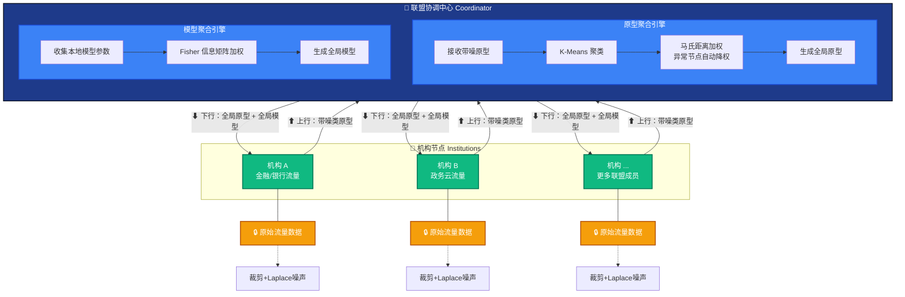
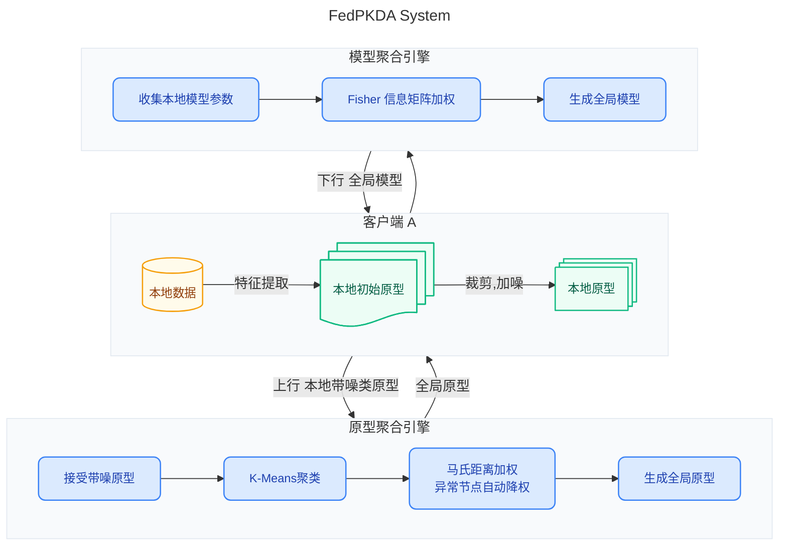
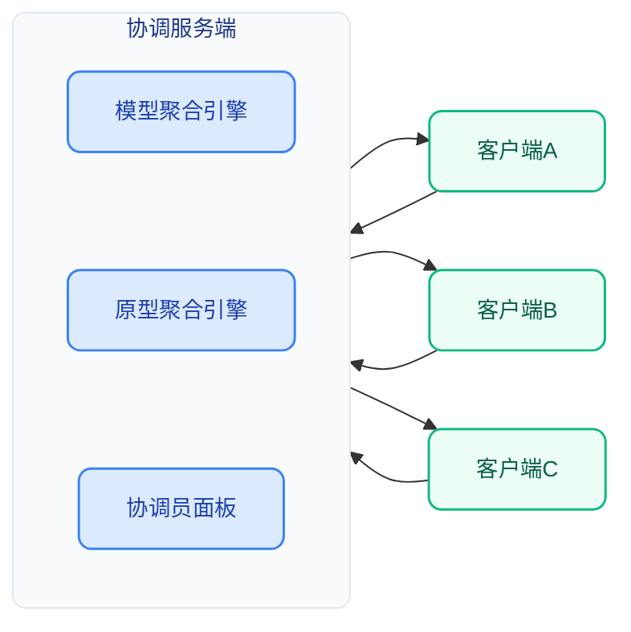

```
                   协调服务器（Coordinator）
   ┌─────────────────────────────────────────────────────┐
   │ ① 收集各客户端的带噪原型                               │
   │ ② K-Means 聚类 → 马氏距离加权（异常自动降权）            │
   │ ③ 生成全局原型 → 广播回客户端                           │
   │ ④ Fisher 加权聚合全局模型 → 下发                       │
   └──────────────┬──────────────────────────┬───────────┘
                  ↕ 上行：带噪原型           ↕ 下行：全局原型 + 模型
   ┌─────────┐   ┌─────────┐   ┌─────────┐   ┌─────────┐
   │ 机构 A   │   │ 机构 B  │   │ 机构 C   │   │  ...    │
   │ 金融流量  │   │ 政务流量 │   │ 能源流量 │   │  其他    │
   ├─────────┤   ├─────────┤   ├─────────┤   ├─────────┤
   │ 本地训练 │   │ 本地训练  │   │ 本地训练 │   │         │
   │ 原型+噪声│   │ 原型+噪声 │   │ 原型+噪声│   │         │
   └─────────┘   └─────────┘   └─────────┘   └─────────┘
        原始数据仅存在于机构本地，协调员从技术上拿不到原型与数据
```






